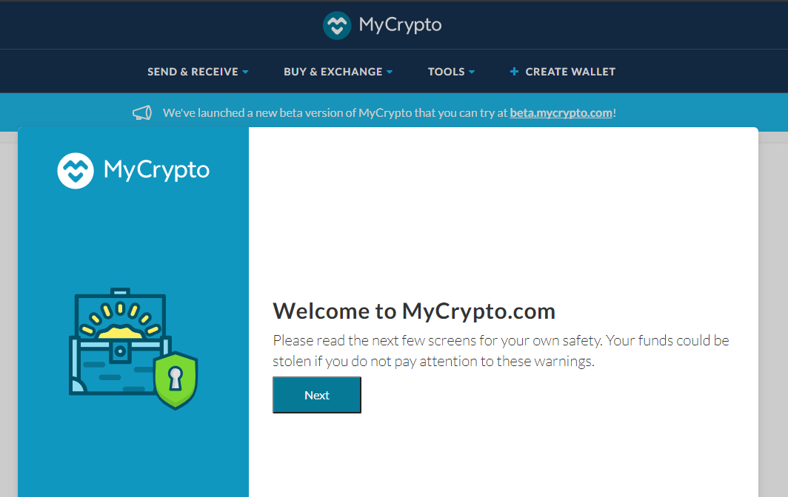
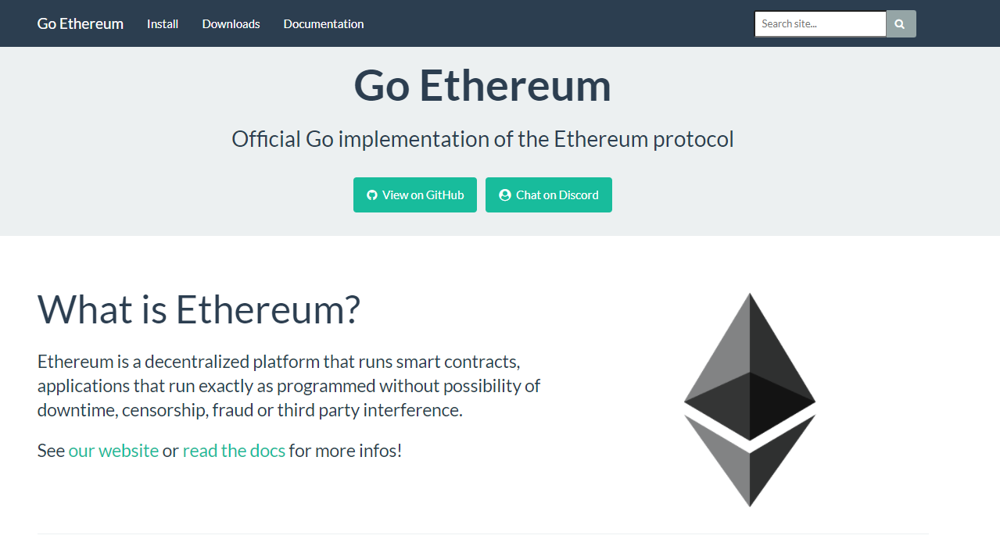
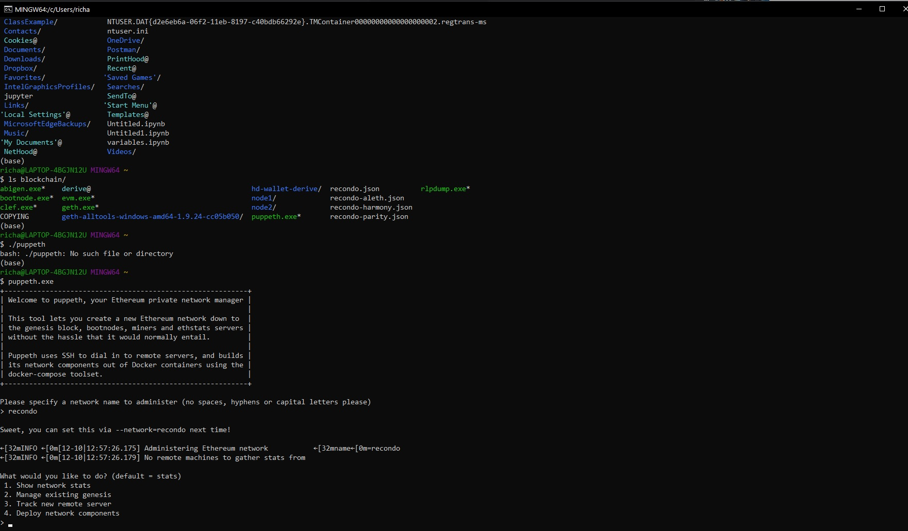

# Pre Requisites:

- Download MyCrypto based on your Operating System @  https://download.mycrypto.com/ and follow the instruction to install

Next, you will need to download Go Ethereum Tools and download @ https://geth.ethereum.org/downloads/ as well :

# Create the network nodes
# Create Genesis Block 
 -  Locate the file location in your system where your blockchain files are stored 
 -  enter the command for Puppeth as ./puppeth.exe or puppeth.exe
 -  You will get a welcome screen and then you will need to create a network name.  
 
 
  We decided on recondo2
