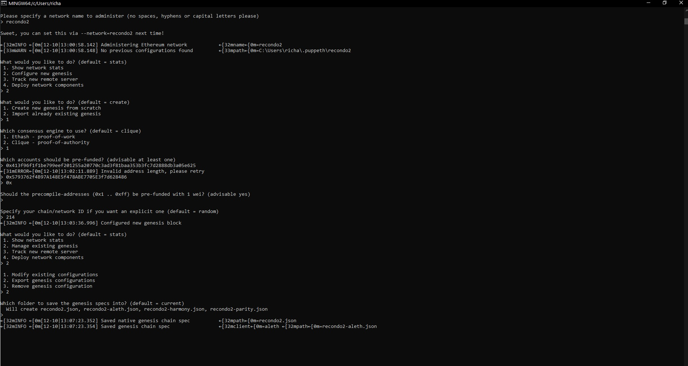
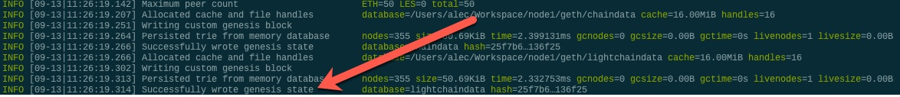

# Pre Requisites:

- Download MyCrypto based on your Operating System @  https://download.mycrypto.com/ and follow the instruction to install

Next, you will need to download Go Ethereum Tools and download @ https://geth.ethereum.org/downloads/ as well :

# Create the network nodes
# Create Genesis Block 
 -  Locate the file location in your system where your blockchain files are stored 
 -  enter the command for Puppeth as ./puppeth.exe or puppeth.exe
 -  You will get a welcome screen and then you will need to create a network name.  
 
 
  We decided on recondo2

 - Follow along on the command prompts and enter your private key to your wallet when asked. It will pre-populate with the 0x prefix
 
 
 - At the end you will need to export your genesis configurations .  We will be using the "recondo2.json" file.  
 
 # Initialize and configure the nodes 
  - Use geth to initalize the nodes by running the following commands :
     
      ./geth init recondo2.json --datadir node1
      
   You should see this message 
   
   
   -  Run the same command for node2

      ./geth init recondo2.json --datadir node2
     
     
   - Run the first node, unlock the account, enable mining, and the RPC flag. Only one node needs RPC enabled.

   - Set a different peer port for the second node and use the first node's enode address as the bootnode flag.

   - Be sure to unlock the account and enable mining on the second node!

You should now see both nodes producing new blocks, congratulations!
     
