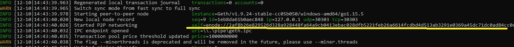
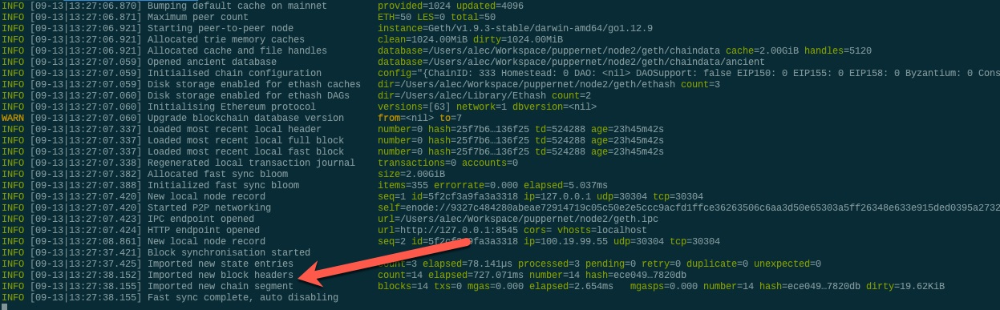

# Pre Requisites:

- Download MyCrypto based on your Operating System @  https://download.mycrypto.com/ and follow the instruction to install

Next, you will need to download Go Ethereum Tools and download @ https://geth.ethereum.org/downloads/ as well :

# Create the Genesis Block 
 -  Locate the file location in your system where your blockchain files are stored 
 -  enter the command for Puppeth as ./puppeth.exe or puppeth.exe
 -  You will get a welcome screen and then you will need to create a network name.  
 
 
  We decided on recondo2

 - Follow along on the command prompts and enter your private key to your wallet when asked. It will pre-populate with the 0x prefix
 
 
 - At the end you will need to export your genesis configurations .  We will be using the "recondo2.json" file.  
 
 # Create and configure the nodes 
   Now, we need to create at least two nodes to build the chain from the genesis block onward:
   Exit puppeth by using the Ctrl+C keys combination.

   Create the first node's data directory using the geth command and a couple of command line flags by running the following line in your terminal window (Git Bash in Windows):
   ./geth account new --datadir node1

   You should see a success message similar to this one:
   
   
   Create a new text file for notes, and copy the node's address into the file and label it Node 1 Key.

   Repeat the same process for the second node by replacing the datadir parameter with the node2 folder.

   ./geth account new --datadir node2

Make sure to keep track of the node's addresses and which belongs to which. You can always fetch the address later by printing the keystore file in the node's folder like so:
cat node1/keystore/UTC--2019-10-08T20-14-04.346928000Z--959a2bd5da6097bab0c2d98e14ebfa65bed06b1b

This will output something like:
  {"address":"959a2bd5da6097bab0c2d98e14ebfa65bed06b1b","crypto":{"cipher":"aes-128-ctr","ciphertext":"07d7df14c082d8d4d14c7d2877c968a9bb624f398c4b820127dcd8d0dfe62bc1","cipherparams":{"iv":"494ce9a4fb08101a52eb3f60b1b80a2f"},"kdf":"scrypt","kdfparams":{"dklen":32,"n":262144,"p":1,"r":8,"salt":"c6a8ce0ed96bada27cd8e82906a78c795953901e90736170180db97196644052"},"mac":"440e051dd3c0333966a403e8a037c50fa80355ea0a911aa323c0f9ef01214f28"},"id":"0de99a24-763b-4c98-8ed7-115954e6d420","version":3}
 
  
  - Use geth to initalize the nodes by running the following commands :
     
      ./geth init recondo2.json --datadir node1
      
   You should see this message 
   
   
   -  Run the same command for node2

      ./geth init recondo2.json --datadir node2
     
     
 # Activating the block chain
 
  -  Launch the first node with the following command : 
     ./geth --datadir node1 --mine --minerthreads 1
     
     The --mine flag tells the node to mine new blocks.

     The --minerthreads flag tells geth how many CPU threads, or "workers" to use during mining. Since our difficulty is low, we can set it to 1.

     You should see the node Committing new mining work:
     
  
   
    Copy this command into your notes and label it Start Node 1.

Now you will launch the second node and configure it to let us talk to the chain via RPC.

Scroll up in the terminal window where node1 is running, and copy the entire enode:// address (including the last @address:port segment) of the first node located in the Started P2P Networking line:
 

We will need this address to tell the second node where to find the first node.
Open another terminal window and navigate to the same directory as before.

./geth --datadir node2 --port 30304 --rpc --bootnodes "enode://<replace with node1 enode address>" --ipcdisable

The output of the second node should show information about Importing block segments and synchronization:

Copy this command into your notes and call it Start Node 2.

   - Run the first node, unlock the account, enable mining, and the RPC flag. Only one node needs RPC enabled.
   - Set a different peer port for the second node and use the first node's enode address as the bootnode flag.

   - Be sure to unlock the account and enable mining on the second node!

You should now see both nodes producing new blocks, congratulations!
     
